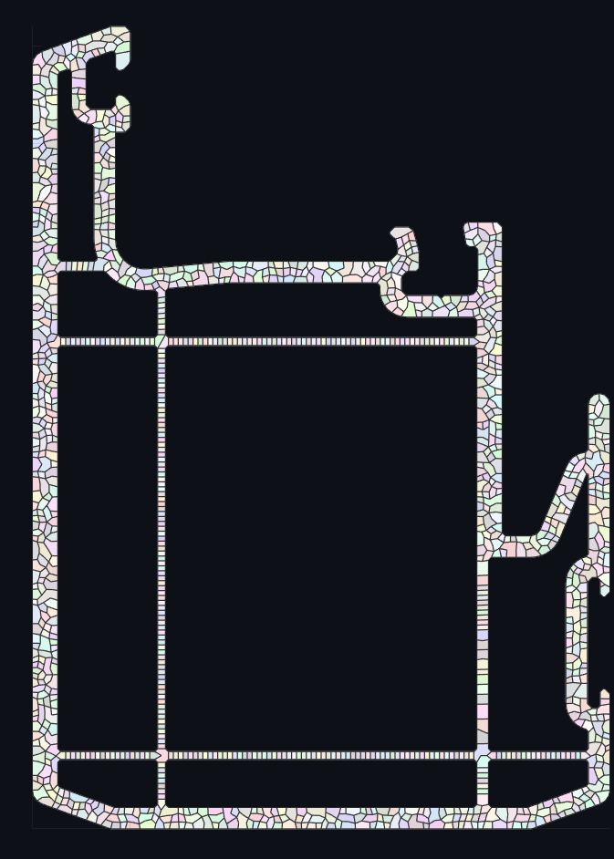

# Mechaide - Matlab Mesh 2D - DIMEC - UChile
[www.mechaide.com](http://www.mechaide.com) 

MATLAB tool for generating meshes from DXF files in 2D. Supports Delaunay triangulation and optimized polygonal meshes D-Polylla with Lloyd relaxation for VEM.

## Requirements
- MATLAB (R2018b or later recommended).
- 2D DXF files with regions only, support regions with holes.

## Installation
1. Clone the repository:
   ```bash
   git clone https://github.com/mechaide/matlab_mesh_2D.git 
   ```

## Usage
Run the following MATLAB script to generate a mesh from a DXF file and automatically export it as mesh.json.

```matlab
clear; clc;

% Parameters
dxf_file = 'myfile.dxf'; % Path to DXF file
d = 0.5; % Vertex separation
mesh_type = 'dpolylla'; % Mesh type: 'triangle' or 'dpolylla'
decimales = 2; % Decimal places for coordinate rounding
iterations = 3; % Lloyd relaxation iterations
plot_contour = true; % Plot contour
plot_base_mesh = true; % Plot base mesh
plot_frontier = true; % Plot frontier edges (dpolylla)
plot_contour_vertices = true; % Plot contour vertices
plot_mesh = true; % Plot final mesh

% Generate mesh
mesh_data = mechaide_MESH.generateMeshFromDXF(dxf_file, d, mesh_type, ...
    decimales, iterations, plot_contour, plot_base_mesh, plot_frontier, plot_mesh);
```

## Parameters
- **`dxf_file`**: String. Path to DXF file (e.g., `'examples/test3.dxf'`). Must contain valid lines/polylines.
- **`d`**: Double (positive). Max vertex spacing and min point distance for Poisson Disk Sampling. E.g., `0.5`. Smaller values increase detail but computational cost.
- **`mesh_type`**: String (`'triangle'` or `'dpolylla'`). `'triangle'` for fast Delaunay triangulation; `'dpolylla'` for optimized polygonal mesh (slower).
- **`decimales`**: Integer (non-negative). Decimal places for coordinate rounding. E.g., `2`. Higher values increase precision but may reduce performance.
- **`iterations`**: Integer (non-negative). Number of Lloyd relaxation iterations. E.g., `3`. More iterations improve mesh uniformity but increase computation time.
- **`plot_contour`**: Boolean. `true` to plot the DXF contour. Useful for geometry verification.
- **`plot_base_mesh`**: Boolean. `true` to plot the base mesh before relaxation.
- **`plot_frontier`**: Boolean. `true` to plot frontier edges (applies only to `'dpolylla'`).
- **`plot_contour_vertices`**: Boolean. `true` to plot contour vertices for debugging.
- **`plot_mesh`**: Boolean. `true` to plot the final mesh.

## Sample Outputs
Below are example visualizations generated by the script for `examples/test3.dxf`:



## Output
- **`mesh_data`**: Struct with:
  - `coords`: Vertex coordinates (Nx2 matrix).
  - `connect`: Mesh connectivity (Mx3 matrix for triangles or cell array for polygons).
  - `contorno`: Contour points (matrix).
  - `hoyos`: Holes (cell array of point matrices).
  - Additional fields based on `mesh_type`.

## Acknowledgments
Inspiration for this project comes from VEMLab by aaortizb, which provided insights into virtual element methods (VEM).
The inspiration for this project comes from VEMLab by aaortizb, a project that contains the code to solve 2D static solids with FEM and VEM.
The Direct Polylla (D-Polylla) algorithm mesh type in this project is based on the [Polylla-Mesh-DCEL](https://github.com/ssalinasfe/Polylla-Mesh-DCEL) algorithm by ssalinasfe. Their work on polygonal meshing using terminal-edge regions and half-edge data structures was adapted for MATLAB.

## Notes
- Console logs include execution times for key steps (e.g., point generation, contour extraction).
- Disable plotting (`plot_* = false`) to speed up execution if only data is needed.
- For large geometries, reduce `d` or `iterations` to optimize performance.

## License
MIT License. See `LICENSE` file for details.

## Author
Nicolás Jesús Muñoz Guamán (nicolasjmunoz@gmail.com / nmunoz@mechaide.com)

## Source
Original code in JS: [www.tesis.mechaide.com](http://www.tesis.mechaide.com)
